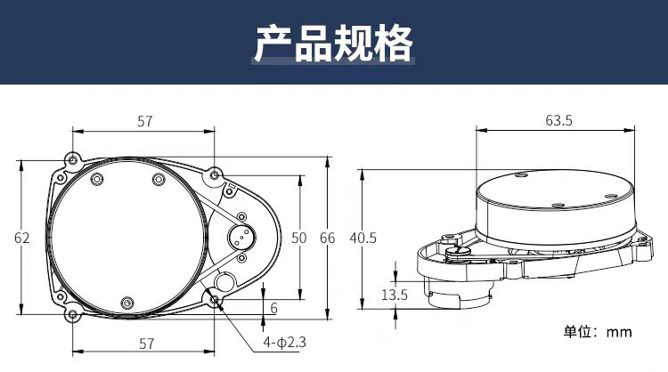
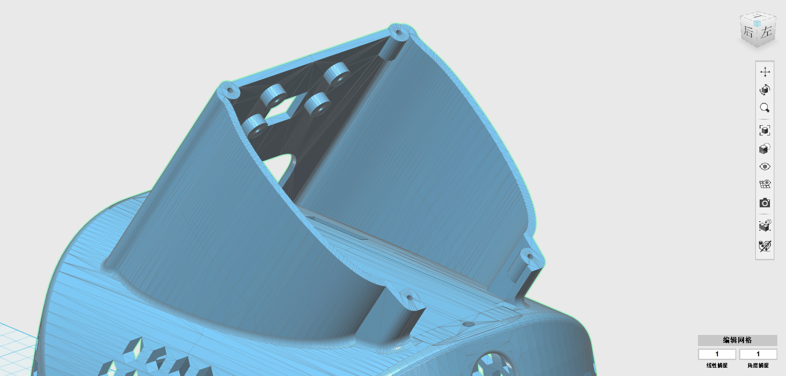
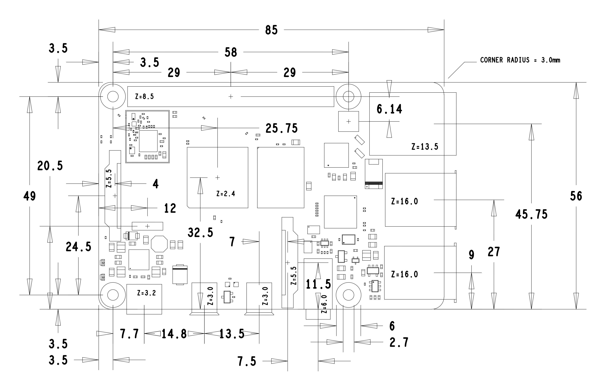
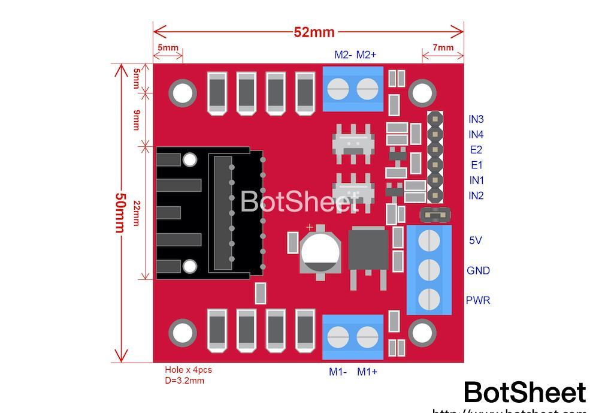

# 各种零件尺寸

### 统一的标准:

   1. 壁厚2mm, 内部隔断(例如电池仓)厚度1mm
   2. 所有螺丝柱壁厚1mm ~ 2mm (螺丝直径较大时壁厚大, 直径较小时壁厚小)
   3. 过渡处务必做的圆滑, 切面最好是圆锥曲线
   4. 设计尺寸不要太大, 可以摆放元器件即可
   5. 所有提供的三维尺寸都有富余

---
### 1. 激光雷达规格:

雷达控制器:(长×宽)46.5mm×23.5mm,
螺丝孔直径3mm
较大的一端向前
雷达开孔平面上不要封闭, 下面有电路板, 会挡到
LIKE THIS: 

---

### 2. 树莓派尺寸:

树莓派主板到外壳的距离:10mm
三维尺寸大概是 88mm×57mm×27mm

---

### 3. 摄像头尺寸:

孔距:(长×宽 )20.6mm×13.34mm
主板到摄像头前端的高度:18mm
螺丝孔直径2mm
三维尺寸大概是 26mm×25mm×21mm

---

### 4. 电机驱动板尺寸:

螺丝孔直径3mm
三维尺寸大概是 45mm×45mm×29mm

---

### 5. 3D ToF镜头尺寸:

单独设计一个堵头, 直径19mm, 前端外扩, 把tof镜头包含在内部,  螺丝孔两侧要削减一下, 适应钢管内径

---

### 6. 扬声器尺寸:
开孔:26.5mm×14mm
两边增加直径为26.5mm的半圆
不需要开螺丝孔
三维尺寸大概是 71mm×31mm×17mm

---

### 7.
电池仓尺寸: 110mm×90mm×50mm, 壁厚1mm
在外壳上开USB-C孔: 3.2mm×9mm, USB-C孔局部区域壁厚减到0.5mm ~ 0.7mm